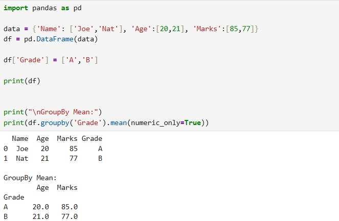
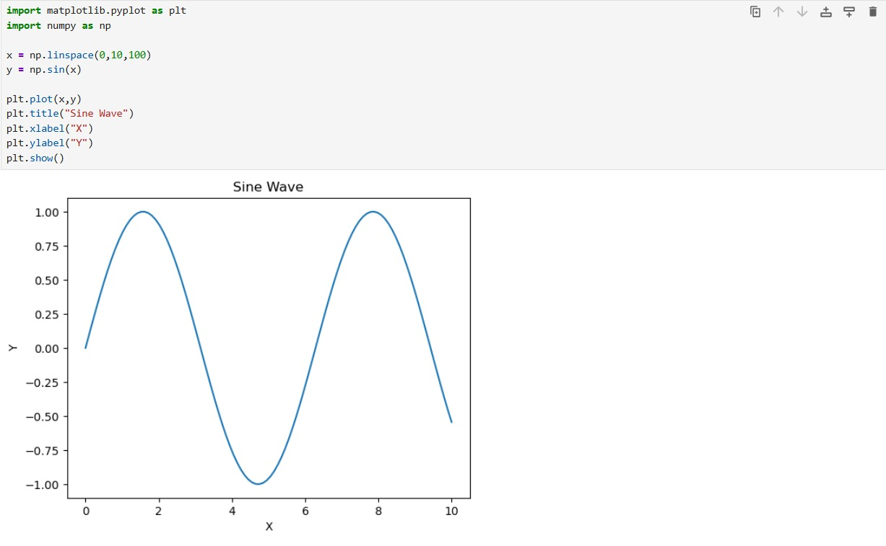
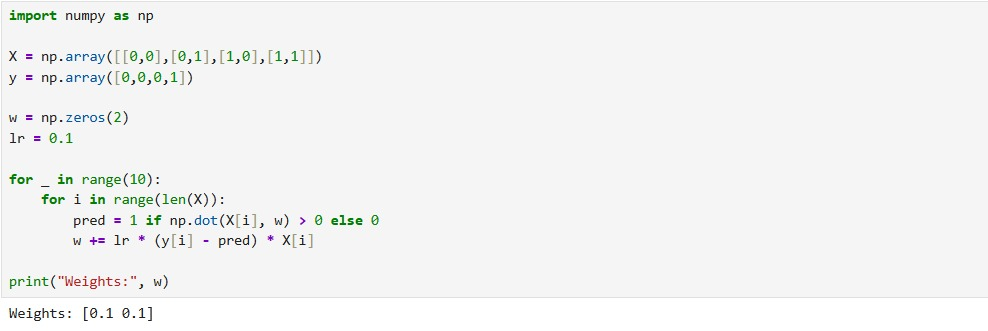
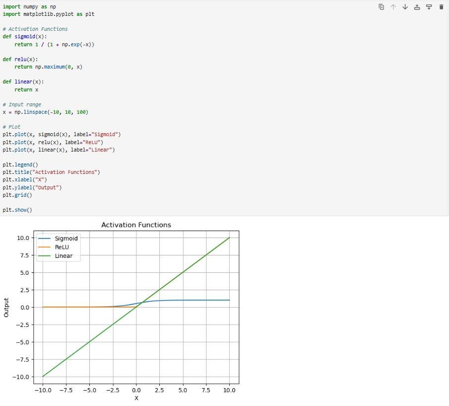
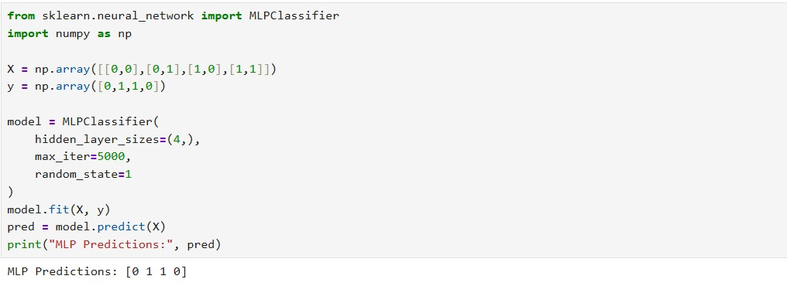
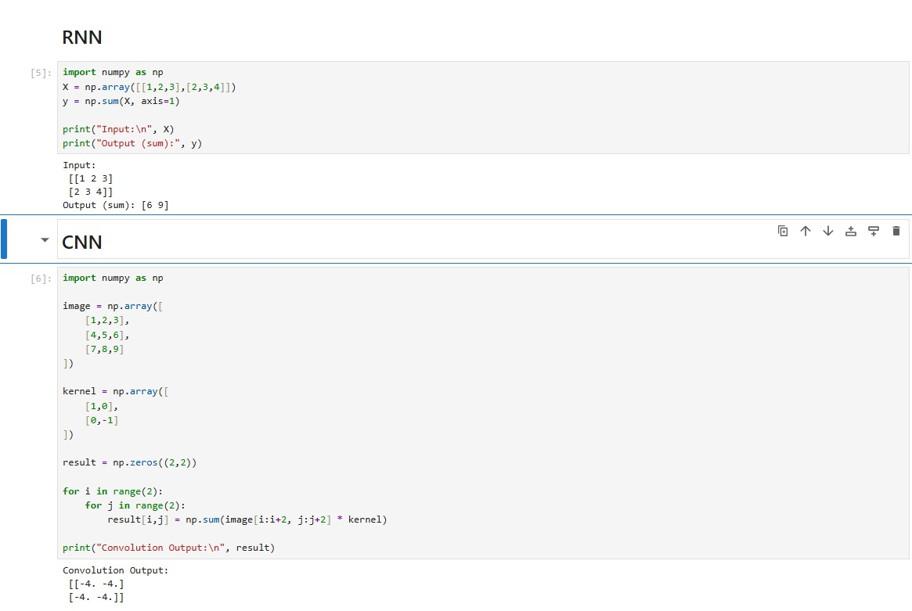
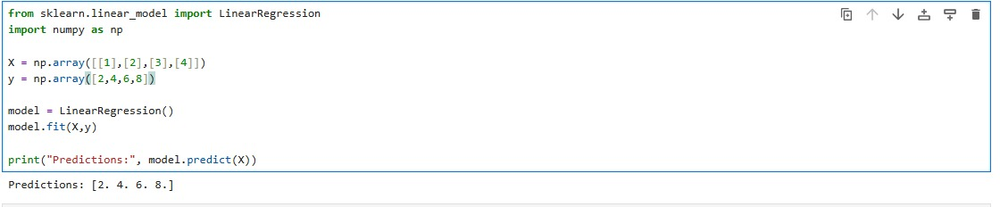
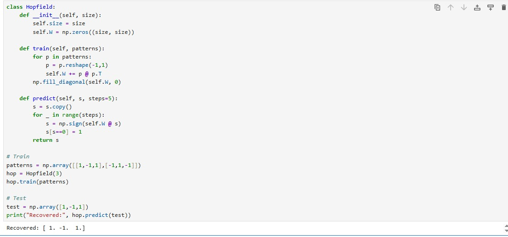

# Neural Network Experiments and Implementations

This repository presents a structured set of neural network experiments implemented from scratch and using standard libraries. The focus is not only on implementation, but on understanding how different models behave, where they fail, and why they are used.

The project progresses from basic numerical operations to advanced neural architectures such as MLP, CNN, RNN, and Hopfield Networks.

---

## Tech Stack

- Python
- NumPy
- Pandas
- Matplotlib
- SciPy
- Scikit-learn

---

## Project Structure
Neural-Network-Lab/
│
├── Ex-1 NumPy/
├── Ex-2 Pandas/
├── Ex-3 SciPy/
├── Ex-4 Plotting/
├── Ex-5 Perceptron/
├── Ex-6 XOR-MLP/
├── Ex-7 Activation/
├── Ex-8 MLP/
├── Ex-9 CNN-RNN/
├── Ex-10 Regression/
├── Ex-11 Hopfield/
│
└── README.md


---

## Experiments Breakdown

### 1. NumPy Operations
Basic array manipulation, matrix operations, and numerical computation.

**Key Insight**  
Vectorization is critical for performance in machine learning pipelines.

**Output**

.jpeg)
.jpeg)

---

### 2. Pandas Data Handling
DataFrame creation, feature addition, and aggregation using group-by.

**Key Insight**  
Data preprocessing is often more important than the model itself.

**Output**



---

### 3. SciPy Operations
Root finding, optimization, sparse matrices, and distance calculations.

**Key Insight**  
Optimization is the backbone of training neural networks.

**Output**

.jpeg)
.jpeg)

---

### 4. Function Visualization
Plotting sine wave using Matplotlib.

**Key Insight**  
Visualization helps in understanding function behavior and model outputs.

**Output**



---

### 5. Perceptron Learning

Implements a basic perceptron using weight updates.

**Key Insight**  
- Works only for linearly separable data  
- Fails on XOR problem  

**Output**



---

### 6. XOR Problem using MLP

Uses hidden layers to solve a non-linear classification problem.

**Key Insight**  
Adding hidden layers introduces non-linearity, enabling complex decision boundaries.

**Output**

/Ex-6_output.jpeg)

---

### 7. Activation Functions

Visualization of Sigmoid, ReLU, and Linear functions.

**Key Insight**

| Function | Behavior | Problem |
|--------|--------|--------|
| Sigmoid | Smooth | Vanishing gradient |
| ReLU | Fast, sparse | Dead neurons |
| Linear | Simple | No learning power |

**Output**



---

### 8. Multi-Layer Perceptron (MLP)

Implementation using Scikit-learn.

**Key Insight**  
MLPs approximate complex functions but require proper tuning.

**Output**



---

### 9. CNN and RNN Basics

- CNN: Convolution operation for feature extraction  
- RNN: Sequence processing using temporal dependency  

**Key Insight**

| Model | Strength | Use Case |
|------|--------|--------|
| CNN | Spatial understanding | Images |
| RNN | Sequential memory | Time series |

**Output**



---

### 10. Linear Regression

Basic regression model using optimization.

**Key Insight**  
Serves as the foundation for gradient-based learning.

**Output**



---

### 11. Hopfield Network

Implements associative memory.

**Key Insight**  
Recalls stored patterns from incomplete or noisy input.

**Output**



---

## Model Comparison

| Model | Type | Limitation |
|------|------|----------|
| Perceptron | Linear | Cannot solve XOR |
| MLP | Non-linear | Needs tuning |
| CNN | Spatial | Requires large data |
| RNN | Sequential | Vanishing gradient |
| Hopfield | Memory | Limited capacity |

---

## What This Project Demonstrates

- Understanding of core ML foundations  
- Implementation from scratch and library-based  
- Ability to analyze model behavior  
- Comparison of different architectures  

---

## How to Run

```bash
pip install numpy pandas matplotlib scipy scikit-learn
python filename.py
